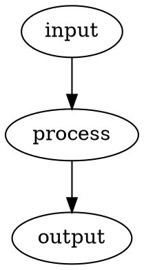

# figurectl

`figurectl` is a Bash/AWK tool for selecting, rendering, and replacing paired
figure representations embedded in ordinary Markdown.

The project is being extracted from the figure-processing implementation in
`wesley-dean/writing`.  The standalone product preserves that implementation's
public command surface and figure syntax while moving the behavior into a
modular, documented, tested, independently released project.

The maintained source will be modular; releases will remain standalone Bash
artifacts.  Built-in input/output implementations are discovered only during the
build and embedded into the generated executable.  Runtime external plugins are
not supported.

> [!NOTE]
> The repository is currently in the governance/specification phase of the
> extraction.  `doc/specification.md` describes the compatibility target, while
> the inherited template executable remains in place until the implementation
> migration lands in a subsequent pull request.

## Intended v1.0 Behavior

The public command surface is:

```text
figurectl.bash select  --format FORMAT [INPUT]
figurectl.bash render  --format FORMAT --figures-dir DIR [--dot-style FILE] [INPUT]
figurectl.bash replace --format FORMAT --figures-dir DIR [--link-prefix PATH] [INPUT]
figurectl.bash process --format FORMAT --figures-dir DIR [--dot-style FILE] [--link-prefix PATH] [--output FILE] [INPUT]
```

The initial authored source formats are:

```text
text
dot
```

The initial requested output formats are:

```text
text
dot
svg
png
```

The output-to-source mapping is:

```text
requested output    selected source
----------------    ---------------
text                text
dot                 dot
svg                 dot
png                 dot
```

SVG and PNG are derived from Graphviz DOT.  Graphviz `dot` is therefore a
conditional runtime dependency required only for graphical rendering.

See [`doc/specification.md`](doc/specification.md) for the complete intended
observable contract.

## Figure Source Form

A figure representation consists of an HTML metadata comment immediately followed
by an ordinary fenced code block:

````markdown
<!-- figure id="example-flow" format="text"
     alt="Example processing flow" -->
```text
input -> process -> output
```

<!-- figure id="example-flow" format="dot"
     alt="Example processing flow" -->

````

Metadata is kept out of the payload so ordinary Markdown remains readable and
payload text may safely contain sequences such as `-->`.

Text and DOT representations sharing an identifier describe the same conceptual
figure.  The tool does not claim to prove semantic equivalence between arbitrary
representations; that remains an author/reviewer obligation.

## Processing Model

figurectl preserves three conceptual responsibilities:

```text
Markdown
   |
   v
select
   |
   v
render
   |
   v
replace
   |
   v
ordinary Markdown
```

`process` performs the complete sequence.  The individual commands remain public
for testing, inspection, and composition.

The phases are architectural responsibilities, not a requirement for separate
executables or a fixed number of physical parsing passes.

## Source and Plugin Architecture

The standalone implementation will use responsibility-focused Bash and portable
AWK source modules.

Core source ordering is explicit.  Genuinely additive input/output modules may be
discovered deterministically during `make build`.  Every supported implementation
is embedded into the release artifact before publication.

The initial project has no runtime plugin discovery, plugin search path, dynamic
sourcing, hot loading, or third-party plugin installation API.  Adding such a
mechanism would change the runtime trust and compatibility boundary and requires a
new architectural decision.

See ADR-018 for the governing decision.

## Runtime and Portability

The intended v1.0 runtime baseline is:

- Bash 4.3 or newer;
- portable AWK; and
- Graphviz `dot` only when SVG or PNG output is requested.

A newer Bash floor may be considered if a concrete Bash 5.x feature materially
improves correctness, security, readability, or maintainability.  The project does
not raise the compatibility floor merely for convenience.

AWK implementation-specific behavior must be identified explicitly rather than
silently weakening the portable-AWK contract.

## Build Lifecycle

GNU Make is the canonical development and CI orchestration surface:

- `make deps` synchronizes repository dependencies and may use the network.
- `make deps-check` verifies prepared dependency state offline.
- `make build` builds release artifacts from maintained source and prepared
  dependency state without synchronizing dependencies.
- `make all` runs `deps` and then `build`.
- `make check` validates maintained source with the configured static-analysis
  tooling.
- `make format` applies the repository's formatting policy.
- `make test` runs behavior tests against every shipped artifact flavor.
- `make test-report` writes JUnit reports under `test-results/`.
- `make docs` generates reference documentation from prepared documentation
  tooling.
- `make clean` removes generated build/test/reference output.
- `make distclean` additionally removes prepared repository dependencies.

`make` is a build/development dependency.  Consumers of released `figurectl`
artifacts do not need Make.

## Release Artifacts

The project retains the template's three-flavor release model:

```text
dist/figurectl.dev.bash
dist/figurectl.bash
dist/figurectl.min.bash
```

Each executable has an adjacent `.sha256` checksum companion.

- `figurectl.dev.bash` retains assembled source documentation.
- `figurectl.bash` is the conventional/default consumer artifact.
- `figurectl.min.bash` is derived from the ordinary artifact using the pinned
  Bash-Minifier build dependency.

Every shipped executable flavor must satisfy the same observable behavior suite.
This is particularly important because the generated Bash artifact will contain
embedded AWK source and therefore passes through multiple source-to-source build
transformations.

## Documentation

The project uses documentation-driven, test-second development.

- [`doc/specification.md`](doc/specification.md) defines intended observable
  figurectl behavior.
- [`doc/decisions.md`](doc/decisions.md) is the concise architecture map.
- [`doc/adr/`](doc/adr/) preserves architectural reasoning and tradeoffs.
- [`doc/engineering-philosophy.md`](doc/engineering-philosophy.md) records reusable
  engineering posture where no specific ADR governs.
- [`doc/documentation-standard.md`](doc/documentation-standard.md) governs
  maintained Bash documentation.
- [`doc/awk-documentation-standard.md`](doc/awk-documentation-standard.md) governs
  maintained AWK documentation.
- [`doc/testing.md`](doc/testing.md) defines testing expectations.
- [`doc/release-verification.md`](doc/release-verification.md) defines release
  verification sequencing.

The AWK documentation standard is intentionally language-specific.  It documents
AWK function returns, pseudo-local formal parameters, global state, record
context, and `BEGIN`/`END`/pattern-action rules rather than mechanically applying
Bash semantics to AWK.

The `awk-doxygen` filter is being developed separately.  Maintained AWK source
follows the standard regardless of whether generated AWK reference documentation
is available yet.

## Architecture Lineage

The figure source and processing model is adapted from
`wesley-dean/writing` ADR-035, which remains historical governance for the writing
repository.  figurectl ADR-017 extracts the reusable behavior while leaving
writing-specific typography, publisher policy, and manuscript governance in the
writing repository.

The generalized built-in input/output architecture deliberately differs from the
original local-script decision to avoid a plugin framework.  figurectl ADR-018
records why the standalone product now chooses deterministic build-time extension
while preserving a single-file runtime boundary.

## License

figurectl is dedicated to the public domain under CC0 1.0 Universal.  See
[`LICENSE`](LICENSE).
