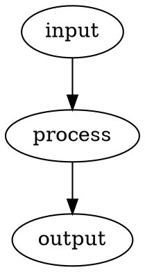

# figurectl

`figurectl` is a Bash/AWK tool for selecting, rendering, and replacing paired
figure representations embedded in ordinary Markdown.

The project was extracted from the figure-processing implementation in
`wesley-dean/writing`.  The standalone product preserves that implementation's
public command surface and figure syntax while moving the behavior into a
modular, documented, tested, independently released project.

Maintained source is modular; generated releases are standalone Bash artifacts.
Built-in input/output implementations are discovered only during the build and
assembled into the generated executable.  Runtime external plugins are not
supported.

> [!NOTE]
> The behavior-preserving source extraction and standalone artifact migration are
> implemented in this repository.  The remaining cross-repository migration step
> is adoption by `wesley-dean/writing`, which will occur separately after a
> suitable figurectl release exists.

## v1.0 Behavior

The public command surface is:

```text
figurectl.bash select  --format FORMAT [INPUT]
figurectl.bash render  --format FORMAT --figures-dir DIR [--dot-style FILE] [INPUT]
figurectl.bash replace --format FORMAT --figures-dir DIR [--link-prefix PATH] [INPUT]
figurectl.bash process --format FORMAT --figures-dir DIR [--dot-style FILE] [--link-prefix PATH] [--output FILE] [INPUT]
```

The initial authored source formats are:

```text
text
dot
```

The initial requested output formats are:

```text
text
dot
svg
png
```

The output-to-source mapping is:

```text
requested output    selected source
----------------    ---------------
text                text
dot                 dot
svg                 dot
png                 dot
```

SVG and PNG are derived from Graphviz DOT.  Graphviz `dot` is therefore a
conditional runtime dependency required only for graphical rendering.

See [`doc/specification.md`](doc/specification.md) for the complete observable
contract.

## Figure Source Form

A figure representation consists of an HTML metadata comment immediately followed
by an ordinary fenced code block:

````markdown
<!-- figure id="example-flow" format="text"
     alt="Example processing flow" -->
```text
input -> process -> output
```

<!-- figure id="example-flow" format="dot"
     alt="Example processing flow" -->

````

Metadata is kept out of the payload so ordinary Markdown remains readable and
payload text may safely contain sequences such as `-->`.

Text and DOT representations sharing an identifier describe the same conceptual
figure.  The tool does not claim to prove semantic equivalence between arbitrary
representations; that remains an author/reviewer obligation.

## Processing Model

figurectl preserves three conceptual responsibilities:

```text
Markdown
   |
   v
select
   |
   v
render
   |
   v
replace
   |
   v
ordinary Markdown
```

`process` performs the complete sequence.  The individual commands remain public
for testing, inspection, and composition.

The phases are architectural responsibilities, not a requirement for separate
executables or a fixed number of physical parsing passes.  The current
implementation deliberately retains the original physical three-pass pipeline
while the compatibility baseline stabilizes.

## Source and Plugin Architecture

Maintained implementation uses responsibility-focused Bash and portable AWK.
Important source locations include:

```text
src/orchestrator.bash
lib/format-registry.bash
lib/renderers/graphviz.bash
lib/plugins/input/*.bash
lib/plugins/output/*.bash
lib/awk/*.awk
scripts/build-artifact.bash
```

Core source ordering is explicit.  Input/output plugins are additive maintained
modules discovered deterministically during `make build`; their paths are not
searched at runtime.  Input plugins register authored-source capabilities such as
materialized extensions.  Output plugins register the authored source they need,
replacement shape, output extension, and optional renderer function.

The portable AWK parser remains explicitly ordered core source rather than a
runtime plugin system.  `make build` concatenates those maintained AWK modules into
literal quoted heredocs inside each generated Bash artifact.  At runtime,
figurectl writes the trusted embedded AWK to a secure temporary file and invokes
`awk -f`; the maintained `lib/awk/` tree is not required after installation.

The project has no runtime plugin discovery, plugin search path, dynamic sourcing,
hot loading, or third-party plugin installation API.  Adding such a mechanism
would change the runtime trust and compatibility boundary and requires a new
architectural decision.

See ADR-018 and
[`doc/built-in-format-plugins.md`](doc/built-in-format-plugins.md).

## Runtime and Portability

The v1.0 runtime baseline is:

- Bash 4.3 or newer;
- portable AWK; and
- Graphviz `dot` only when SVG or PNG output is requested.

A newer Bash floor may be considered if a concrete Bash 5.x feature materially
improves correctness, security, readability, or maintainability.  The project does
not raise the compatibility floor merely for convenience.

AWK implementation-specific behavior must be identified explicitly rather than
silently weakening the portable-AWK contract.

## Build Lifecycle

GNU Make is the canonical development and CI orchestration surface:

- `make deps` synchronizes repository dependencies and may use the network.
- `make deps-check` verifies prepared dependency state offline.
- `make build` builds release artifacts from maintained source and prepared
  dependency state without synchronizing dependencies.
- `make all` runs `deps` and then `build`.
- `make check` validates maintained Bash syntax/static analysis plus portable-AWK
  loadability.
- `make format` applies the repository's Bash formatting policy.
- `make test` runs the public behavior suite against every shipped artifact
  flavor.
- `make test-report` writes one JUnit report per artifact flavor under
  `test-results/`.
- `make adr-index` generates linked ADR navigation from maintained framing and the
  current ADR corpus using prepared `adrctl` state.
- `make docs` regenerates the ADR landing page and generates Bash/AWK reference
  documentation using prepared, language-specific Doxygen filters.
- `make clean` removes generated build/test/reference output.
- `make distclean` additionally removes prepared repository dependencies.

`make` is a build/development dependency.  Consumers of released `figurectl`
artifacts do not need Make, bashdeps, Bash-Minifier, adrctl, either Doxygen filter,
or the maintained source tree.

## Release Artifacts

The project uses the three-flavor release model:

```text
dist/figurectl.dev.bash
dist/figurectl.bash
dist/figurectl.min.bash
```

Each executable has an adjacent `.sha256` checksum companion.

- `figurectl.dev.bash` retains assembled source documentation, including embedded
  AWK documentation.
- `figurectl.bash` is the conventional/default consumer artifact and removes
  full-line comments while preserving behavior.
- `figurectl.min.bash` is derived from the ordinary artifact using the pinned
  Bash-Minifier build dependency.

Every shipped executable flavor must satisfy the same observable behavior suite.
This is particularly important because the generated Bash artifact contains
embedded AWK source and therefore passes through multiple source-to-source build
transformations.

Release validation follows a late-tagging, least-privilege model.  Repository
build/dependency/test code runs in a read-only validation job with Graphviz present
and exercises the exact candidate artifacts, including Bash 4.3 compatibility.
The resulting six release files are transferred to a separate publication job,
checksum-verified again, attested, and only then published with the release tag.
The publication job does not check out or rebuild figurectl source.

See [`doc/release-verification.md`](doc/release-verification.md), ADR-011, and
ADR-020.

## Testing

The public Bats contract is executed against all three generated artifacts.  It
covers the CLI, figure parsing, source selection, materialization, replacement,
metadata validation, unsafe identifiers, stdin, Graphviz rendering, captions,
link prefixes, and compatibility warnings.

CI additionally verifies checksums, deterministic build bytes, Bash syntax,
minimum-Bash representative behavior, standalone execution after `src/`, `lib/`,
`scripts/`, and `vendor/` are removed from the runtime environment, and the
ignored generated-state boundary for ADR navigation and Doxygen output.

See [`doc/testing.md`](doc/testing.md).

## Security and Trust Boundaries

The build-time-only plugin boundary prevents local runtime filesystem state from
silently changing which implementation executes.  Figure identifiers are
validated before they become generated filenames, and Graphviz/style input is
passed as data rather than evaluated as Bash source.

The project does not sandbox Graphviz or promise that arbitrary malicious DOT is
safe to parse.  Build and documentation dependencies plus runtime
interpreters/renderers remain part of the trusted computing base according to
their authority.  The pinned adrctl dependency participates only in generated ADR
navigation and does not enter release artifacts or runtime behavior.  Release
validation and publication are separated so the larger build/test surface does
not intentionally inherit release-write or OIDC authority.

See [`doc/threat-model.md`](doc/threat-model.md), ADR-015, ADR-016, ADR-020, and
ADR-021.

## Documentation

The project uses documentation-driven, test-second development.

- [`doc/specification.md`](doc/specification.md) defines observable figurectl
  behavior.
- [`doc/decisions.md`](doc/decisions.md) is the concise architecture map.
- [`doc/adr/`](doc/adr/) preserves architectural reasoning and tradeoffs.
- [`doc/engineering-philosophy.md`](doc/engineering-philosophy.md) records reusable
  engineering posture where no specific ADR governs.
- [`doc/documentation-standard.md`](doc/documentation-standard.md) governs
  maintained Bash documentation.
- [`doc/awk-documentation-standard.md`](doc/awk-documentation-standard.md) governs
  maintained AWK documentation.
- [`doc/built-in-format-plugins.md`](doc/built-in-format-plugins.md) defines the
  internal build-time format-module contract.
- [`doc/threat-model.md`](doc/threat-model.md) records the current security and
  trust-boundary analysis.
- [`doc/testing.md`](doc/testing.md) defines testing expectations.
- [`doc/release-verification.md`](doc/release-verification.md) defines release
  verification sequencing and authority boundaries.

`make docs` uses the pinned `bash-doxygen` filter for maintained Bash and the
pinned `awk-doxygen` filter for maintained AWK.  The pinned `adrctl` artifact
assembles `doc/adr/README.intro.md`, a linked list generated from the current ADR
corpus, and `doc/adr/README.outro.md` into ignored `doc/adr/README.md`; Doxygen
uses that generated Markdown as the reference landing page.  All three repository
documentation tools are prepared through bashdeps, and documentation generation
itself does not synchronize dependencies.

Generated `doc/adr/README.md` and `doc/reference/` remain derivative of maintained
source and are not committed.  Routine documentation generation does not include
an ADR relationship graph.  Explicit Graphviz figure rendering and maintained
security diagrams remain separate concerns.

## Architecture Lineage

The figure source and processing model is adapted from `wesley-dean/writing`
ADR-035, which remains historical governance for the writing repository.
figurectl ADR-017 extracts the reusable behavior while leaving writing-specific
typography, publisher policy, and manuscript governance in the writing repository.

The generalized built-in input/output architecture deliberately differs from the
original local-script decision to avoid a plugin framework.  figurectl ADR-018
records why the standalone product chooses deterministic build-time extension
while preserving a single-file runtime boundary.

## License

figurectl is dedicated to the public domain under CC0 1.0 Universal.  See
[`LICENSE`](LICENSE).
