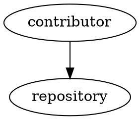

# figurectl Specification

This document defines the intended observable contract for `figurectl`.  It is a
consumer-facing specification.  Architecture Decision Records explain why the
contract has its current shape; maintained source documentation explains local
implementation details; tests provide executable evidence for this specification.

The standalone implementation preserves the figure-processing behavior extracted
from the `wesley-dean/writing` repository.  Adoption by that repository is a
separate consumer-migration step and does not make the standalone contract
provisional.

## Purpose

`figurectl` processes paired figure representations embedded in ordinary Markdown.
It allows an author to keep text and Graphviz DOT representations near the prose
that gives them meaning while producing publication-specific Markdown and generated
assets for text, DOT, SVG, or PNG output.

The tool owns three conceptual phases:

1. selection of the authored representation needed for the requested output;
2. rendering or materialization of selected figure assets; and
3. replacement of figure directives with ordinary Markdown suitable for downstream
   publication tooling.

The `process` command performs the complete pipeline.  The individual phases remain
public because they are useful for testing, inspection, and composition.

## Command-Line Interface

The initial public command surface is:

```text
figurectl.bash select  --format FORMAT [INPUT]
figurectl.bash render  --format FORMAT --figures-dir DIR [--dot-style FILE] [INPUT]
figurectl.bash replace --format FORMAT --figures-dir DIR [--link-prefix PATH] [INPUT]
figurectl.bash process --format FORMAT --figures-dir DIR [--dot-style FILE] [--link-prefix PATH] [--output FILE] [INPUT]
```

Supported requested output formats for the initial release are:

```text
text
dot
svg
png
```

When `INPUT` is omitted, input is read from standard input.

`--output` applies to `process`.  When omitted, processed Markdown is written to
standard output.

Diagnostics are written to standard error.  Successful data output is written to
standard output or the caller-selected output file as appropriate.

## Figure Source Representation

A figure representation consists of:

1. an HTML comment containing figure metadata; immediately followed by
2. an ordinary fenced code block containing the authored representation.

The initial authored formats are `text` and `dot`.

Example:

````markdown
<!-- figure id="repository-trust-boundaries" format="text"
     alt="Repository trust boundaries from contributor through CI/CD" -->
```text
+-------------+       +-------------+
| Contributor | ----> | Repository  |
+-------------+       +-------------+
```

<!-- figure id="repository-trust-boundaries" format="dot"
     alt="Repository trust boundaries from contributor through CI/CD" -->

````

The metadata comment contains metadata only.  Figure payload must not be placed
inside the comment.  Payload may therefore contain `-->` without terminating the
metadata comment unexpectedly.

The directive may span multiple lines.  Attribute order, ordinary indentation,
line wrapping, and spacing around `=` do not change meaning.

The fenced block information string must agree with the declared source format.
A mismatch is an error rather than a condition the tool guesses around.

Backtick and tilde fences are supported.  Fences may be longer than three
characters when required by the payload.

Ordinary Markdown outside recognized figure declarations passes through unchanged.

## Figure Metadata

The supported initial metadata keys are:

- `id`;
- `format`;
- `alt`; and
- optional `caption`.

`format` identifies the authored source language, not the requested publication
output.

Stable `id` and useful `alt` text are the normal authoring contract.  The initial
implementation may retain compatibility fallback behavior for missing identifiers
or alternative text, but such fallbacks are recovery behavior rather than preferred
authoring practice.

Identifiers used to create filenames must be constrained to a safe filename form.
The compatibility baseline accepts identifiers matching:

```text
[A-Za-z0-9][A-Za-z0-9._-]*
```

Duplicate representations with the same identifier and the same authored source
format are errors.  The same identifier may appear once for `text` and once for
`dot` so paired representations can describe one conceptual figure.

## Requested Output and Selected Source

The caller requests the desired output format.  `figurectl` selects the authored
source representation required to produce that output.

The initial mapping is:

```text
requested output    selected source
----------------    ---------------
text                text
dot                 dot
svg                 dot
png                 dot
```

SVG and PNG are derived from DOT.  They are not independently authored source
formats.

## Select Phase

`select` reads Markdown and retains only figure representations whose authored
format is required by the requested output.

Conceptually:

```text
select(text) -> retain text figures; remove dot figures
select(dot)  -> retain dot figures;  remove text figures
select(svg)  -> retain dot figures;  remove text figures
select(png)  -> retain dot figures;  remove text figures
```

The selector does not interpret the semantic meaning of text or DOT payloads and
does not render Graphviz output.

## Render Phase

`render` materializes selected figure payloads beneath `--figures-dir`.

Initial relationships are:

```text
text -> .txt
dot  -> .dot
dot  -> Graphviz -> .svg
dot  -> Graphviz -> .png
```

Only assets required for the requested operation need to be produced.

Graphviz `dot` is a conditional runtime dependency required only when SVG or PNG
rendering is requested.

When `--dot-style FILE` is supplied for graphical rendering, the selected style
resource is caller-owned policy.  Publication styling is not hard-coded into the
reusable `figurectl` implementation.

## Replace Phase

`replace` transforms selected figure declarations into ordinary publication
Markdown.

For `text`, the result is a fenced text block representing the materialized text
asset.

For `dot`, the result is a fenced DOT block suitable for diagnostic or authoring
use.

For `svg` and `png`, the result is a Markdown image reference using the figure's
alternative text and generated asset path.

`--link-prefix` controls the path prefix used in graphical Markdown references.
When a caption exists, it is preserved in the publication result.

After replacement, publication Markdown must not require downstream tools to
understand figure directives.

## Process Phase

`process` performs the complete select, render, and replace sequence for one
requested output format.

Conceptually:

```text
Markdown
   |
   v
select
   |
   v
render
   |
   v
replace
   |
   v
ordinary Markdown
```

The existence of the three conceptual phases does not require separate runtime
executables or physical reparsing passes.  Implementations may evolve internally
while preserving the observable phase contracts.

## Paired Representation Semantics

Text and DOT representations carrying the same figure identifier describe the same
conceptual figure.

The tool does not promise to prove semantic equivalence between arbitrary text and
DOT.  Changes to labels, nodes, relationships, direction, grouping, or meaningful
ordering in one authored representation require review of the paired representation
when one exists.

Semantic equivalence is therefore an author/reviewer obligation, not an automated
validation guarantee.

## Generated Assets

Generated `.txt`, `.dot`, `.svg`, and `.png` files are build products.  They are
not independent authoring surfaces.

The caller owns generated-directory lifecycle policy.  `figurectl` must not infer
publication retention or pruning policy beyond files it is explicitly asked to
produce.

## Runtime Dependencies

The initial runtime baseline is:

- Bash 4.3 or newer;
- portable AWK; and
- Graphviz `dot` only for SVG or PNG rendering.

GNU Make, bashdeps, Bash-Minifier, Doxygen filters, test frameworks, and other
repository tooling are build or development concerns and are not runtime
requirements of released artifacts.

## Plugin and Extension Boundary

Input/output implementations are maintained project modules discovered during the
build.  Released artifacts contain the selected implementations and remain
standalone.

The initial project does not support runtime plugin discovery, external plugin
files, directory scanning, dynamic sourcing, hot loading, or a third-party plugin
installation contract.

A future external plugin mechanism would change runtime trust, compatibility, and
distribution boundaries and therefore requires a new architectural decision.

## Release Artifacts

The project follows the inherited three-flavor release model:

```text
figurectl.dev.bash
figurectl.bash
figurectl.min.bash
```

Each executable has a `.sha256` checksum companion.

All shipped executable flavors must satisfy the same observable behavior contract.
The ordinary `figurectl.bash` artifact is the conventional/default consumer
artifact.

## Testing Expectations

The behavior suite must exercise every shipped artifact flavor.

Coverage should include at least:

- CLI parsing and invalid usage;
- source/output mapping;
- metadata parsing and attribute-order tolerance;
- safe and unsafe identifiers;
- paired text/DOT identifiers;
- duplicate same-format identifiers;
- backtick and tilde fences;
- longer fences;
- payload containing `-->`;
- ordinary Markdown preservation;
- malformed or unterminated declarations;
- metadata/fence format mismatch;
- text and DOT materialization;
- SVG and PNG rendering;
- missing Graphviz behavior;
- captions and alternative text;
- stdin and named-file input;
- stdout/stderr separation;
- link-prefix behavior; and
- behavioral equivalence across development, ordinary, and minified artifacts.

Generated-artifact tests must specifically exercise the embedded AWK program so
comment stripping and minification are not assumed to preserve behavior without
evidence.

## Non-Promises

The initial release does not promise:

- automatic semantic equivalence checking between text and DOT;
- conversion of arbitrary text diagrams to DOT;
- generation of semantic text diagrams from Graphviz raster-style text output;
- runtime or third-party plugins;
- a generalized external renderer installation API;
- pixel-identical Graphviz output across Graphviz versions, fonts, and platforms;
- atomic publication-directory replacement; or
- ownership of downstream publication styling or asset-retention policy.
