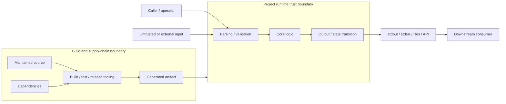

# Threat Modeling

This document provides a reusable threat-modeling exercise for projects derived
from template-bash.  It is intentionally lightweight enough to use during real
engineering work while still forcing explicit consideration of trust boundaries,
data exposure, dependencies, failure modes, and residual risk.

Not every Bash project needs a large formal threat-model document.  Projects that
handle credentials, private data, untrusted input, destructive operations,
network access, privileged files, release credentials, dynamic loading, or other
security-relevant authority should perform this exercise explicitly and preserve
the result in maintained documentation.

A project-specific threat model describes the current system.  ADRs still explain
why consequential architectural choices were made, and a normative specification
still defines public behavior when one exists.

## 1. State the Security Objectives

Begin with bounded statements about what the project is trying to protect or
preserve.

Examples:

- a selected redaction policy prevents matching data from reaching a log sink;
- a destructive command never acts outside an explicitly selected path;
- a downloaded dependency is verified against an expected digest before
  execution;
- stdout remains a data channel and diagnostics remain on stderr; and
- release credentials are not exposed to untrusted pull-request code.

Avoid opening with broad claims such as "the tool is secure."  A useful objective
is specific enough that a reviewer can ask whether the implementation and tests
actually support it.

## 2. Identify Assets

List the things whose confidentiality, integrity, availability, or correct
interpretation matters.

Depending on the project, assets may include:

- credentials, tokens, private keys, or configuration secrets;
- user or customer data;
- source code;
- files the tool may modify or delete;
- stdout/stderr contracts;
- local or remote repository state;
- generated release artifacts;
- checksums, signatures, attestations, and tags;
- CI/CD credentials;
- dependency manifests and pinned digests;
- developer trust in documented guarantees; and
- application state that must survive partial failure.

Do not limit assets to secrets.  Integrity and availability can be as important as
confidentiality.

## 3. Identify the Trusted Computing Base

Document what code, runtimes, services, and actors must behave correctly for the
security objectives to hold.

Ask:

- Which Bash interpreter/runtime assumptions are trusted?
- Which project source files are trusted?
- Which sourced libraries or subprocesses execute with project authority?
- Which build, CI, documentation, scanner, and release dependencies are trusted?
- Which external services or APIs are trusted?
- Which decisions are explicitly delegated to the caller or operator?

Every dependency expands this list.  Pinning and checksums establish expected
identity of acquired bytes; they do not prove behavioral safety.

## 4. Draw the Trust Boundaries

Identify where data or authority crosses from one responsibility or trust domain
into another.

Common Bash-project boundaries include:

```text
caller -> sourced library
CLI argv -> parser
stdin -> parser/transformer
repository -> dependency manager
network -> downloaded artifact
maintained source -> generated artifact
CI job -> release credentials
application data -> logger/stderr
local tool -> remote API
untrusted file -> shell command construction
```

A boundary is worth documenting when crossing it changes who controls data, what
authority is available, or which assumptions become necessary.

### Mermaid Diagram Template

For maintained Markdown on GitHub, Mermaid is preferred for architectural threat
model diagrams because the source remains reviewable text and GitHub renders it
without a separate generation step.

A project may adapt this starting point:



The diagram should show **trust boundaries and meaningful data/authority flows**,
not every function call.  If the picture becomes a second implementation diagram,
it is probably too detailed for the threat model.

DOT/Graphviz remains appropriate when a project specifically needs Graphviz's
layout capabilities or already generates diagrams as build artifacts.  Mermaid is
the default here because the maintained diagram stays beside the prose that
explains it.

## 5. Enumerate Entry Points and Data Flows

For each public command/function and important automated workflow, trace where
input comes from and where output/state goes.

Include:

- command-line arguments;
- environment variables;
- stdin;
- configuration files;
- repository files;
- network responses;
- sourced library state;
- generated files;
- stdout/stderr;
- temporary files;
- subprocess arguments/environments;
- API requests;
- CI artifacts; and
- release publication.

The goal is not a perfect diagram.  It is to expose places where untrusted or
sensitive data encounters code with authority.

## 6. Consider Threat Actors and Failure Sources

Threat modeling should include more than malicious remote attackers.

Useful categories include:

- an application developer making an incorrect assumption;
- an operator supplying the wrong path or option;
- attacker-controlled input;
- malformed input;
- stale or partially updated state;
- unavailable dependencies or services;
- compromised upstream dependencies;
- hostile code in the same process;
- a compromised CI runner;
- excessive privilege;
- a future maintainer misunderstanding an invariant; and
- ordinary platform/runtime behavior that invalidates an assumption.

The model should say which actors/failures are inside the protection boundary and
which are explicitly outside it.

## 7. Walk Threats by Boundary

For each trust boundary, ask at least:

### Confidentiality

- Can sensitive data be logged, traced, exported, persisted, or passed to a
  subprocess unexpectedly?
- Can a dependency see more data than it needs?
- Can failure diagnostics echo protected input?

### Integrity

- Can untrusted input become shell syntax, command options, a pathname outside the
  intended scope, a template language, or an evaluation language?
- Can a dependency or build step modify release bytes unexpectedly?
- Can output be forged, confused, or interpreted differently downstream?

### Availability

- Can malformed input cause unbounded loops, recursion, resource exhaustion, or
  deadlock-like waiting?
- What happens when dependencies, files, networks, or credentials are unavailable?
- Does fail-closed behavior intentionally sacrifice availability for another
  property?

### Authentication / Authorization / Authority

- Which operations require credentials or elevated privileges?
- Is the code executing with more filesystem, network, repository, or release
  authority than it needs?
- Could untrusted code reach those credentials or privileged operations?

### Interpretation

- Can text be reinterpreted as shell code, regex replacement syntax, terminal
  control sequences, structured-data syntax, or command options?
- Are explicit delimiters or escaping rules needed?

## 8. Review Dependencies as Threat Boundaries

For every new dependency, ask:

1. What code executes?
2. What data can it observe?
3. What authority does it inherit?
4. What input does it parse?
5. What side effects can it produce?
6. What transitive code becomes trusted?
7. How are exact bytes selected and verified?
8. What happens if it is compromised or unavailable?
9. How difficult would replacement/removal be?
10. Can existing Bash facilities or already-reviewed dependencies satisfy the
    need with less trusted code?

A dependency whose purpose sounds mundane can still become a critical attack
surface.  Logging libraries, parsers, templating engines, documentation filters,
and release actions are all examples of code that may gain surprising authority
or data exposure.

See ADR-015.

## 9. Record Mitigations and Residual Risk

For each meaningful threat, record:

```text
Threat
    -> mitigation(s)
    -> evidence
    -> residual risk / non-promise
```

Do not treat the mitigation as complete merely because code exists.  Evidence may
include:

- focused behavior tests;
- negative security assertions;
- static analysis;
- runtime compatibility tests;
- dependency pinning/verification;
- code review;
- least-privilege workflow configuration;
- release attestations; or
- explicit architectural constraints.

Residual risk is important.  If the project cannot defend a boundary honestly,
document that fact rather than manufacturing a claim the runtime does not
provide.

## 10. Identify Review Triggers

A threat model should be revisited when a change adds or materially alters:

- a dependency;
- network access;
- filesystem write/delete behavior;
- privileged execution;
- credentials or secret handling;
- untrusted-input parsing;
- `eval`, dynamic code generation, or templating/evaluation semantics;
- subprocess execution;
- plugin/dynamic-loading behavior;
- a logging/output sink;
- persistence;
- a public API or output format;
- a compatibility/runtime floor;
- build transformations;
- CI/release authority; or
- a security/privacy claim.

The trigger is expansion of authority, data exposure, trust, or interpretation,
not merely code size.

## Suggested Project Document

A project that needs a maintained threat model can use this outline:

```text
# Threat Model

## Scope and Security Objectives
## Assets
## Trusted Computing Base
## Trust Boundaries
## Trust-Boundary Diagram
## Entry Points and Data Flows
## Threat Actors and Failure Sources
## Threats, Mitigations, and Residual Risk
## Explicit Non-Goals
## Security Evidence
## Threat-Model Review Triggers
```

The document should link to governing ADRs, specifications, tests, and security
policies rather than duplicate every detail.

## Review Principle

The value of threat modeling is not the number of threats listed.  Its value is
forcing changes in authority, data exposure, interpretation, or trust to become
visible before they are normalized as ordinary implementation details.
